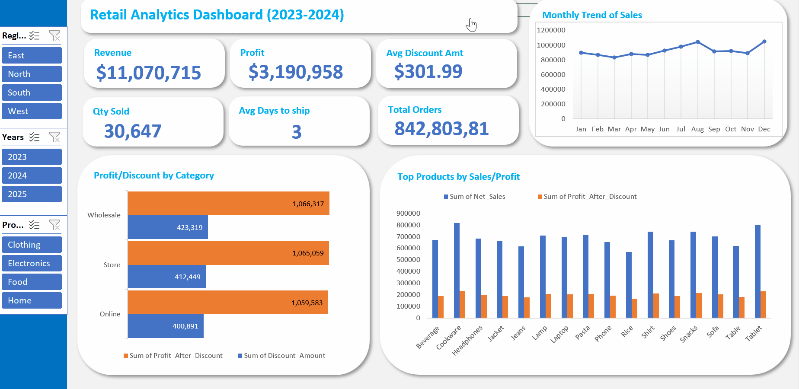
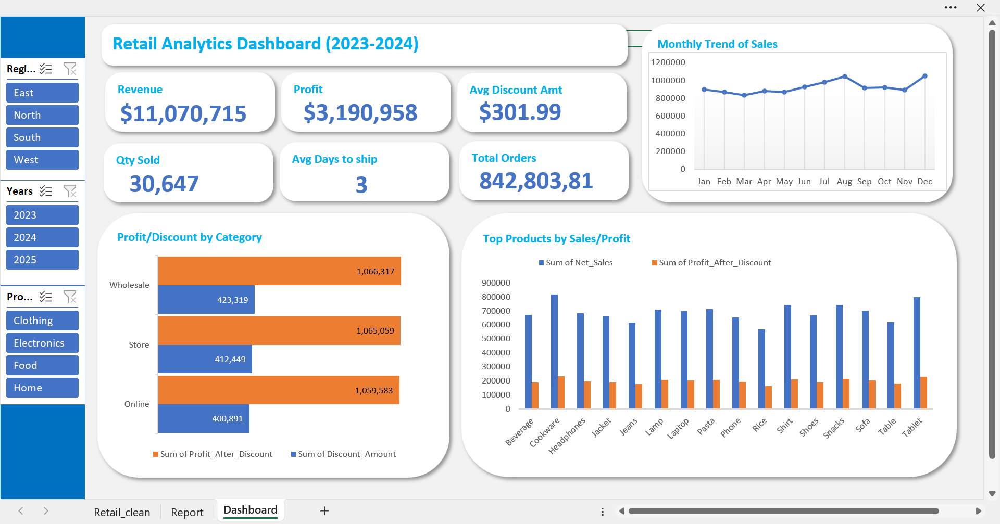

# 📊 Retail Sales Business Intelligence Dashboard

An automated Business Intelligence solution built with **Microsoft Excel, Power Query, and VBA** that transforms raw retail sales data into interactive executive dashboards for monitoring sales performance, profitability, and operational efficiency.

> **
---

## 📌 Project Overview

This project analyzes retail transactions from **2023–2025** to provide real-time visibility into business performance. It combines data cleaning, automation, KPI tracking, and interactive visualizations to support faster, data-driven decision-making.

---

## 🚀 Key Features

- Automated data refresh (every 30 minutes)
- Power Query ETL pipeline
- Interactive dashboard with slicers
- Executive KPI cards
- Regional & product performance analysis
- Sales, profit & discount monitoring
- One-click refresh using VBA Macro

---

## 📊 Dashboard Preview

> **

---

## 💼 Business Insights

- 📈 Revenue exceeded **$11M**, demonstrating consistent business growth.
- 💰 Profit reached **$3.19M**, though increasing discounts indicate pressure on profit margins.
- 🌍 Regional analysis revealed performance gaps, highlighting opportunities for targeted sales strategies.
- 📦 Product analysis identified top-performing products driving overall revenue.
- 🚚 Average shipping time of **3 days** reflects strong operational efficiency.

---

## 🎯 Recommendations

- Optimize discount strategies to improve profit margins.
- Strengthen underperforming regions through targeted marketing and distribution.
- Prioritize high-margin products to maximize profitability.
- Continue monitoring operational KPIs to sustain fulfillment performance.

---

## 🛠️ Technologies Used

- Microsoft Excel
- Power Query
- Pivot Tables & Pivot Charts
- VBA Macros
- Data Modeling
- Conditional Formatting

---

## 📁 Skills Demonstrated

- Data Cleaning & Transformation
- Business Intelligence Reporting
- Dashboard Design
- KPI Development
- ETL Automation
- Sales & Profit Analysis
- Executive Reporting
- Data Visualization

---

## 🔗 Project Access

📂 **Dashboard:** *([Access here](https://github.com/Osi-Chidera-John/Retail-Sales-Performance-Intelligence-Dashboard-2023-2025-Automation/blob/main/Retail_Sales.xlsm))*

---

## 📬 Contact

**Chidera John**  
Founder, **Jemva**

📧 chiderajohn519@gmail.com

💼 LinkedIn: *[View Profile](https://www.linkedin.com/in/john-chidera-jr/)*

---

>  Transforming data into actionable business intelligence.
